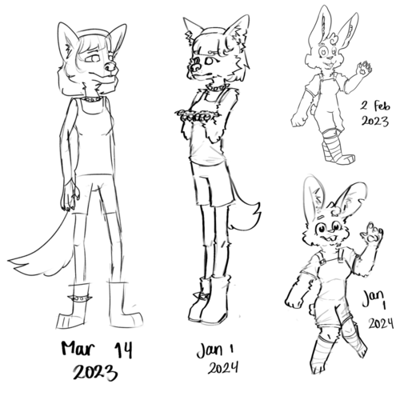
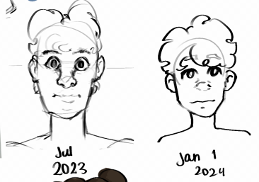

Happy new year!!! 🥳 (I'm still alive btw)

Oh and yeah, I lost my daringcuteseal.xyz domain, I couldn't renew it bcz.. prize :P I'm considering to get a domain with `my.id` TLD bcz it's pretty cheap.

A lot of things have happened in 2023, I'd say that it's the most meaningful year to me so far. I've spent all my energy in making a school recap for my student council so I really don't wanna write many things here LoL. But anyways, I do have some personal highlights this year.

## LineageOS
I started daily driving LineageOS since Jan 2 2023. Sadly though, I forgot my pin (don't ask how) after I switched it around December 2023 so I couldn't really call it a year 😭

I'm actually still trying to brute force the pin LMAO. The stuff there aren't insanely important, but everything is configured so perfectly there and I still had some photos so yeah. If I still have the chance to get it back I really should try to. Oh and I use TWRP's openrecoveryscript tool to try to decrypt my phone using a list of 10000 pins. It's still running :P

## Deeper into the Programming World
As the title says

Thank you [bro](https://ezntek.github.io) :D

Oh also thank you for recommending me Qtile ;D I love it too much.

## Physical Journalling
I'm too attached to the past and I don't ever wanna lose memories anymore, so I decided to journal on a physical book (instead of using a digital note-taking app) starting on July 2023. Pretty useful bcz I can't jot down thoughts during class or when it's incovenient to use a computer/phone.

## Daily Stoic
I found [Daily Stoic's site](https://dailystoic.com/) after I looked around for daily Stoic readings, and I have read their mail every morning.

## Art Studies
I have decided to take art more seriously, and so I started following YouTube art tutorials. Turns out I knew 0 art basics, and I have only properly stretch my artistic muscles recently. Hey, I think I did OK.

I redrew some of my old work yesterday, and wow all the art studies are totally worth it.

## Student Council
I enrolled myself to my school's student council once again and this time, they made me the coordinator for the *"Information Technology Development and Communication"* section. I actually proposed myself to be a secretary but nah, they just have to put me somewhere else. I have never gotten the role that I originally wanted 💀

Although the start was a bit boring, I did not fret at all at the end. It was fun. The responsibilities are crazy, but I gained so much experience. I also got to be the creator of our [student council's blog](https://osisphi.wordpress.com) (I used Wordpress bcz people will continue the blog and they may not understand smth like GH Pages) and go to another school of my same campus for a student exchange program 😁

## Bali
I visited Bali for the first time! I've always dreamt of going there, and I finally got the chance to. It's actually not as special as I thought but it was still fun anyways :D

## Project-Based Learning
It's actually part of our new national curriculum. Basically we all have to make a STEM-related project, this time related to sustainability.

Our team picked to make a "smart" urban farming pot which is cool and all that. It's actually pretty useless but like, you know, it's cool. We (planned) to hook sensor-hooked Arduino to our planter.

AND WE GOT CHOSEN TO JOIN OUR SCHOOL'S COMPETITION 💀 (just bcz the other teams are lazier, we did not actually make a good proposal.)

I have no idea if we're able to finish the project LMAO, we still have a bunch of mock exams later on so damn it

## I Liked my Own Best Friend! (A bit too personal but ok)
And no it didn't end good (as usual)

Still confused on how it happened but it did and now he left me 😔👍

And the worst part is we're in the same homeroom and we have been for three years or as long as we have known each other so I have to see him every single day 💃💀💀

He's my first long-term close friend (not anymore) that understands Linux and stuff. Also the first to use Signal for me. I don't think I'll have some friends over at Signal now without him. Aw no, I can write an entire blog for this. Too sad. Bye bro, I'm gonna miss you.

# Final Words
Still a bit attached to 2023 but hey, starting something new is always about stopping to look back. 🌟

I did great and I hope that I could do better this year!