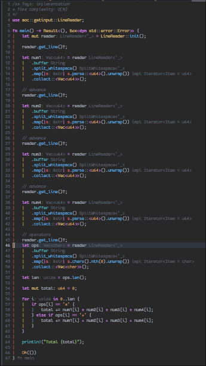
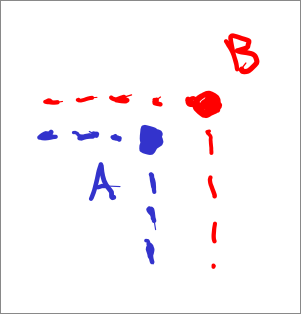
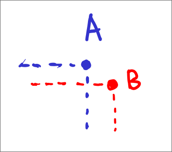
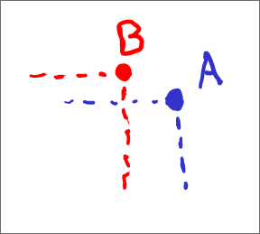

Wheew, my first time finishing an [Advent of Code](https://adventofcode.com) calendar! I think I'm the slowest participant to hit the finish line (I finished on Dec 29) 😅 But it's okay, because early on I had a really annoying mandatory school final semester project and it de-motivated me a bit.

Anyway, this year I mostly used Rust. I had these goals in mind:
- [ ] No external libraries
   Well, I thought I could do it until I finally got hit with problems that include parsing nightmare and iterator hell. Thus, I added [nom](https://github.com/rust-bakery/nom) and [itertools](https://github.com/rust-itertools/itertools/) to my dependencies list.
- [x] All solutions must run under a second
    All of them did except for my 9th day part 2 when ran with extra checks (still gives correct answer without it, though).
- [x] Do not implement any naive solution that comes right off my mind
    Yep, except when I don't think there's a better solution than the one I can think of right away.
- [x] Try my best before giving up
    I did, except for the last day. It was too suspicious and I couldn't help but to check the trick.
- [x] Just Chill™
    For sure.

Overall, it was fun I guess! I learned a ton of stuff along the way. I'd like to share my solutions' breakdowns too (I haven't reviewed much of others' solutions yet, though!).

# 1

> [Day 1: Secret Entrance](https://adventofcode.com/2025/day/1)
> 
> You're tasked to find the password to enter the North Pole base by using a rotating dial.

This problem is actually the only one I answered with a C++ code.
## a
The first part is pretty standard modular arithmetic. The idea is to simply to simulate the operations and count how many times the dial points to 0 after an operation.

The problem, though: C++'s modulo doesn't work with negative dividend. I had to write a custom modulus function that works with negative numbers:

```c++
long long modn(long long x, long long n) {
	if (x < 0) return (n - (-x % n))) % n;
	else return x % n;
}
```

## b
Now this one is supposed to be easy, but damn, the amount of silly mistakes I made-

I "initially attempted to check only the landing position" (this was left in my C++ source file; I don't remember anymore). But obviously, that's incorrect since it's no different than the first part.

I finally got the logic right the second time. The occurrence of 0 for each operation is the number of times it rotated completely plus 1 if it passed 0 during the "redundant" rotation, 0 otherwise.

The redundant rotation check is a bit tricky for me, at least the left rotation one. I initially did the checks like this:
```c++
...
if (instruction[0] == 'R') {
    occurrence += (num / 100) + (pos + (num % 100) >= 100 ? 1 : 0);
    pos = modn(pos + num, 100);
} else if (instruction[0] == 'L') {
    occurrence += (num / 100) + (pos - (num % 100) <= 0 ? 1 : 0);
    pos = modn(pos - num, 100);
}
...
```


However, I just couldn't get the answer correctly. As it turns out, if we get the left instruction and the initial position was already 0, the redundant rotation cannot ever pass 0 anymore. This fixed it:
```c++
...
} else if (instruction[0] == 'L') {
    occurrence += (num / 100) + (pos != 0 && pos - (num % 100) <= 0 ? 1 : 0);
...
```


# 2
> [Day 2: Gift Shop](https://adventofcode.com/2025/day/2)
> 
> You're tasked to find all invalid IDs among several product ID ranges (they were added by a young elf).

This is the point where I read the problem and go, "damn it, C++ ain't gonna cut it". I could not imagine myself writing the loops and all that in C++, let alone debugging when things go wrong.

## a

My naive idea was this: uh, just loop through the ranges and check if it's an invalid pattern?

But eh, of course, I'm not allowed to implement naive solutions, remember? _Maybe there is some kind of pattern_, so I continued checking. And indeed, we can easily know the first valid pattern that comes after the start of the range.

There are two cases for our start of range: either the number of digits is odd, or it's even. In the case that it's odd, we can simply repeat the first $\lceil\frac{2}{n}\rceil$ digits twice, then continue generating the next patterns from there until we hit the dead end.

In the case that it's even, however, we got two possibilities: repeat the first $\frac{2}{n}$ digits twice, or repeat the first $\frac{2}{n}$ digits, plus one, twice. The plus one is needed when the number formed by the first $\frac{2}{n}$ digits is less than the other half. For example, the number 812813 has its first half (812) less than its other half (813), so the first valid pattern is going to be (812 + 1) repeated twice, i.e, 813813.

And after we know how to generate the invalid patterns, we just sum them up.

```rust
for range in ranges {
    ...

    // if number of digit is odd
    if digits(start) % 2 == 1 {
        // set the repeatable chunk to the number from the first ceil(n/2) digits
        ...
    } else {
        ...
        // slice our number to two
        let (left, right) = slice2(start);
        // do the first half and right half comparison
        if left < right {
            segment = left + 1;
        } else {
            segment = left;
        }
    }

    // loop until we hit dead end
    ...
}
...
```

## b

_Oh no, generalization!_ My first thought is that this _probably_ has pattern as well. But unfortunately, I couldn't find any and even if one exists, it'll probably be too convoluted. I did still attempt to write the smart version but it failed miserably because I missed a bunch of edge cases.

Anyway, I actually wrote two working solutions later. In the first one, I looped through every single number from every single range and see if it's invalid (by checking if it's a certain number repeated n times). However, this turned out to be somewhat slow.
```rust
...
for range in ranges {
    ...
    for i in start..=end {
        if is_pattern(i) {
            sum += i;
        }
    }
}
...
```


In the second code, I tried to build invalid patterns from the ground up until I hit a dead end, i.e stop when the number of digits in my repeatable chunk is greater than half the number of digits of the range's end. Turns out, this is way faster.


```rust
...
for range in ranges {
    // to prevent duplicates, e.g 1 four times and 11 twice should be the same
    let mut checked_patterns: HashSet<i64> = HashSet::new();
    ...
    let mut chunk: i64 = 1;
    let mut len;

    'a: loop {
        // set the length appropriately to the first one possible so we don't
        // spend time checking the obviously wrong (valid) ones
        if digits_start % digits_chunk == 0 {
            len = (digits_start / digits_chunk).max(2);
        } else {
            len = (digits_start / digits_chunk + 1).max(2);
        }

        let mut result = repeat_num(chunk, len);
        while result <= end {
            // keep repeating until we hit the end range
            ...
        }
        chunk += 1;

        // if the length of the digits of our chunk is now inappropriate
        if digits(chunk) > digits(end) / 2 {
            break 'a;
        }

    }
}
...
```

# 3

> [Day 3: Lobby](https://adventofcode.com/2025/day/3)
> 
> You're tasked to determine the maximum joltage you can make from each bank (by picking subset of numbers).

## a

For this part, we can simply loop through the string and set the first number to be the highest we have found, so long as it's not the last number of the string. We do this for the second number as well.

```rust
for line in lines {
    ...

    for d in 0..length {
        // first digit
        if digits[d] > max_first_digit && d < length - 1 {
            max_first_digit = digits[d];
            max_second_digit = 0;
        // second
        } else if digits[d] > max_second_digit {
            max_second_digit = digits[d];
        }
    }

    total += max_first_digit * 10 + max_second_digit;
}
```


## b
The second part of the problem is the generalization of the first one. I guess I could have written 12 `else if` branches—but that would've been tiring, so I just used an array:

```rust
for line in lines {
    ...
    let mut max_digits: [u32; 12] = [0; 12];
    let length = digits.len();

    for d in 0..length {
        for i in 0..12 {
            if !(digits[d] > max_digits[i] && d <= length - (12 - i)) {
                continue;
            }
            max_digits[i] = digits[d];
            for j in i + 1..12 {
                max_digits[j] = 0;
            }
            break 'inner;
        }
    }
    ...
}
```

# 4

> [Day 4: Printing Department](https://adventofcode.com/2025/day/4)
> 
> You're tasked to help the elves remove rolls of papers so you can.. break through the wall to get to the cafeteria. Yup.

## a
I don't really know a non-naive solution, so I just went with looping through each paper roll and checking if it's accessible or not (by the said rules):

```rust
const NEIGHBORS: [(i64, i64); 8] = [
    (-1, -1),
    (-1, 0),
    ...
    (1, 1),
];

...
for row in 0..map.len() {
    'b: for col in 0..cols {
        // no paper roll
        if !map[row][col] {
            continue 'b;
        }

        let mut neighbors_count = 0;
        'c: for (r, c) in NEIGHBORS {
            // check neighbor
            ...
        }

        if neighbors_count < 4 {
            count += 1;
        }
    }
}
...

```

Maybe there's some kind of trickery you can do here, but then again, this is already sub-optimal as it's $O(RC)$ where $R$ = rows and $C$ = columns. I don't think anything can beat that, because you need to check all paper rolls anyway.

## b

Now we're asked to simulate the paper roll removal. To be fair, I couldn't think of a non-naive solution here, either. However, I used a small optimization trick: keeping track of the neighbor count for each paper roll. This way, I don't have to keep recalculating the neighbors to know which paper rolls I can remove. Then, I just basically do a multi-pass sweeping from top to bottom and remove all paper rolls I can remove.

```rust
// count neighbors, like from part a
...

loop {
    let mut done = true;
    for row in 0..map.len() {
        'b: for col in 0..cols {
            if !map[row][col] {
                continue 'b;
            }

            if neighbors[row][col] < 4 {
                // erase the paper roll
                map[row][col] = false;

                done = false;
                count += 1;

                ...
                'c: for (r, c) in NEIGHBORS {
                    // out of map
                    if !(new_r >= 0 && new_r < rows_i && new_c >= 0 && new_c < cols_i) {
                        continue 'c;
                    }

                    // reduce the neighbors
                    neighbors[new_r as usize][new_c as usize] -= 1;
                }
            }
        }
    }
    if done {
        break;
    }
}
...
```


# 5

> [Day 5: Cafeteria](https://adventofcode.com/2025/day/5)
> 
> You're tasked to help the elves find fresh ingredient IDs from their new inventory management system.

This line right here:
> [...] "If only we hadn't switched to the new inventory management system right before Christmas!" another Elf exclaims.

It reminds me of the times when I upgrade my (Artix btw) Linux system right before an important task and it ruined my day. Oh well, I guess we can't really blame the elves.

## a

The first part screams point query in an interval tree. Basically, create an interval tree for the range of fresh IDs, insert the ranges, then just query the points (made with interval with same start and end).

```rust
...
for q in queries {
    if ranges.contains(&Int::new_point(q)) {
        count += 1;
    }
}
...
```

For the interval query, I wrote my own interval tree that augments a standard non-self-balancing BST (also my own—judging by the fact that it's non-self-balancing). It was good enough for this purpose.

Funny enough, I thought that interval trees are for "containment" queries (i.e interval a is contained by b if `a.start >= b.start` and `a.end <= b.end`). I had a terrible time making a containment tree by reading guides about interval tree. Eventually, I did make it work, and I ended up with a tree that can do both overlapping range query and containment query. How fun (albeit pretty unnecessary).

## b

For the second part, I use a `BTreeMap` that holds fresh ingredient ranges and orders the elements using ranges' start as the sorting key. Whenever I add a new range, it and any overlapping ranges are merged into one. The list is then guaranteed to hold non-overlapping ranges, so then, I can simply loop through all the ranges and count how many fresh ingredients are there.

```rust
```rust
...
while reader.get_line()? != 0 {
    let (start, end) = reader.buffer.trim().split_once('-').unwrap();
    ...

    // delete any overlapping intervals
    ...

    // insert the new interval, which is the result of the new interval
    // merged with any other overlapping intervals.
    ranges.insert(start, end);
}

let mut count: u64 = 0;
for (s, e) in ranges {
    count += e - s + 1;
}
...

```

I used a lot of non-stable features here actually (not shown), like Cursors for BTree. I needed it for the sake of being able to use the `upper_bound` method to find where I should start doing overlap checks to this new interval. Coming from doing competitive programming with C++, I'm surprised this is not available in stable Rust.

# 6

> [Day 6: Trash Compactor](https://adventofcode.com/2025/day/6)
> 
> You're tasked to help a young cephalopod with her math homework.

Okay, but, why do they even have those??

## a

Anyway, this is starting to look somewhat cumbersome to parse, but at this point I still wanted to not have any external parsing libraries. Thus, my code consists of mostly me doing tedious string parsing:



Since this is simply a problem that requires you to implement the rules they gave, the logic is pretty straightforward.
```rust
...
let mut total: u64 = 0;

for i in 0..len {
    if ops[i] == '*' {
        total += num1[i] * num2[i] * num3[i] * num4[i];
    } else if ops[i] == '+' {
        total += num1[i] + num2[i] + num3[i] + num4[i];
    }
}
...

```

## b

For the second part, my code is a bit long, but really what it's just doing is parsing each number entries with padding (0). The maximum length of a number is obtained by making use of the problem gaps that exist in the operators row.

```rust
...
#[derive(Default, Debug)]
struct Problem {
    operation_type: OperationType,
    digits_len: usize,
    nums: Vec<Vec<Option<u8>>>,
}

impl Problem {
    fn evaluate(&self) -> u64 {
        ...
        for i in index.rev() {
            let mut tens_factor = 1;
            let mut formed_number = 0;

            // we have to reverse the order because we are reading from top to
            // bottom, and the number with the smallest 10 factor is at the bottom
            // fortunately, both addition and multiplication are commutative.
            for num in self.nums.iter().rev() {
                formed_number += if let Some(x) = num[i] {
                    let res = x as u64 * tens_factor;
                    tens_factor *= 10;
                    res
                } else {
                    0
                };
            }

            match self.operation_type {
                OperationType::Addition => sum += formed_number,
                OperationType::Multiplication => sum *= formed_number,
            }
        }
        sum
    }
}
...
```

And yes, I'm still doing manual string parsing (not shown).


# 7

> [Day 7: Laboratories](https://adventofcode.com/2025/day/7)
> 
> You're tasked to fix a broken teleporter so you can escape a North Pole research wing.

## a
The first part of the problem reminds me of another similar problem I've solved before, titled [Waterfall](https://tlx.toki.id/problems/osn-2010/3D) (it's written in Indonesian, by the way). Just that instead of finding the best spot for the tachyon beam to enter the manifold, we have to calculate the number of beam splits that will occur, given a starting spot.

Funny story, I got slightly confused with the definition of a beam "splitting" and I wrote the solution for part 2 when trying to solve part 1.

But anyway, my first part had this DP recurrence relation:

$$
f(r, c) = \begin{cases}

0 & \text{if out of map} \\
0 & \text{if visited already} \\
1 + f(r, c-1) + f(r, c+1)  & \text{if tile is splitter} \\
f(r + 1, c) & \text{otherwise}

\end{cases}
$$

Essentially, whenever a beam hits a splitter, it will get split once—thus adding 1 to our total sum. It will also create 2 new beams, which might split again later—thus we call `f(r, c - 1)` and `f(r, c + 1)` to get the number of splits that will occur for each of the newly created beams. When a beam doesn't hit a splitter, it just travels down like normal. The "if visited already" here is needed so we don't solve for the same table entry twice, as when two beams overlap, they're considered as just one beam.

I wrote a recursive function to solve this proble. I know that it isn't the best thing to do, but I just can't help but to try it for this problem because in the Waterfall problem, I only used simple `for` loops. Experimentations are cool, yk?

```rust
...
type Map = Vec<Vec<MapItem>>;
type Marker = Vec<Vec<bool>>;

fn splits(marker: &mut Marker, map: &Map, row: i64, col: i64) -> u64 {
    ...
    if row >= rows || col >= cols || col < 0 {
        // base case: out of map so no splits will occur. return 0
    } else if marker[rw][cl] {
        // visited already, don't try to do it again (return 0).
    } else if map[rw][cl] == MapItem::Splitter {
        // this is a splitter: split the beam.
        marker[rw][cl] = true;
        let result = 1 + splits(marker, map, row, col - 1) + splits(marker, map, row, col + 1);
        return result;
    } else {
        // blank space: propagate downwards.
        marker[rw][cl] = true;
        let result = splits(marker, map, row + 1, col);
        return result;
    }
}
...
```


## b

This is yet another DP problem. To be specific, this is the counting-total-ways (the beam can travel) style. DP is important here because we do not want to waste resources calculating the number of ways a beam can travel down for the same tile (position) over and over again.

Thus, I came up with this (which I just copied from my previously deleted part 1 solution):

$$
f(r, c) = \begin{cases}

1 & \text{if r = last row} \\
0 & \text{if out of map} \\
f(r, c-1) + f(r, c+1)  & \text{if tile is splitter} \\
f(r + 1, c) & \text{otherwise}

\end{cases}
$$

This one I think is simpler to think of. There are two ways a beam can travel when it hits a splitter, so obviously the timelines possible is the timelines possible if it travels to the left and if it travels to the right. If the beam isn't in a splitter, it'll just continue propagating downwards (i.e just 1 timeline possible).

```rust
fn timelines(dp: &mut DP, map: &Map, row: i64, col: i64) -> u64 {
    ...
    if row == rows - 1 {
        // base case: we're at the last row. there's only 1 timeline.
    } else if col < 0 || col >= cols {
        // base case: we're out of the map (invalid column). no timeline
        // is even possible. return 0.
    } else if let Some(val) = dp[rw][cl] {
        // we already know the answer so return that.
        return val;
    } else if map[rw][cl] == MapItem::Splitter {
        // either it goes to the left or it goes to the right
        let result = timelines(dp, map, row, col - 1) + timelines(dp, map, row, col + 1);
        dp[rw][cl] = Some(result);
        return result;
    } else {
        // only one possibility: travelling down again
        let result = timelines(dp, map, row + 1, col);
        dp[rw][cl] = Some(result);
        return result;
    }
}
```

# 8


> [Day 8: Playground](https://adventofcode.com/2025/day/8)
> 
> You're tasked to help the elves connect electrical junction boxes together so electricity reaches all decoration lights.

## a

So the elves are doing a greedy approach: repeatedly connect two junction boxes that are the closest together (luckily, this approach does result in the global minima—that's _minimum spanning tree_ for you!). This problem fits perfectly under the category of graph problems, so we'll use graph-related terminologies here.

Obviously, to know which junction box to connect, we need to know which two pairs of the boxes are the closest at a time. Thus, we need to store the list of all pairs of boxes and their distances (i.e the edges and the distances as the weight), and we need a way to access the one with the shortest distance quickly. Binary heap would make a perfect data structure for that, as we can do $O(1)$ query to get the pair of junction boxes closest at a time.

After two junction boxes are connected, they belong in the same component. To keep track of this set membership data, we can use a DSU (disjoint union set). Now, our objective is to keep track of the graph's component sizes after the first 1000 connections.

To simplify my life (and further Advent of Code instances), I wrote a custom disjoint set union that:
* Stores the number of components that exist, which is updated after each join operation. This allows $O(1)$ time for number of components query.
* Stores a `BTreeMap` that stores [component size, component count] as [key, value]. The list is sorted ascending (from components of smallest sizes to largest sizes).
* Allows $O(1)$ query of the size of a component that any given element belongs to.

So now, my job is to do the first 1000 connections, then check the component sizes. Pretty easy with the help of my `ChonkDSU` (yes).

```rust
static COUNT: usize = 1000;

use aoc::{chonk_dsu::ChonkDSU};
...
let mut dsu = ChonkDSU::new(jboxes.len());

// connect the first N pairs of junction boxes closest together.
for _ in 0..COUNT {
    let edge = possible_connections.pop().unwrap();
    dsu.unite(edge.0.a, edge.0.b);
}

...

// count the sizes of the three largest circuits.
for (size, count) in dsu.get_components_map().iter().rev() {
    for _ in 0..*count.min(&(3 - processed)) {
        result *= size;
        processed += 1;
    }
    if processed == 3 {
        break;
    }
}
...
```

## b

Oh great, it's literally just part one but _actually_ finish our circuit (and also take note of the last processed pair of junction boxes)!

There are many ways to check if we're done connecting all junction boxes together in the same circuit, such as by checking the size of the component newly merged or by counting the number of components that exist. I went with the latter since it's the easiest.

```rust
...
let mut last_a_idx: usize = 0;
let mut last_b_idx: usize = 0;

// this time, connect ALL of the junction boxes until we only have 1 component left.
while dsu.n_components() > 1 {
    let edge = possible_connections.pop().unwrap();
    last_a_idx = edge.0.a;
    last_b_idx = edge.0.b;
    dsu.unite(edge.0.a, edge.0.b);
}

let x1 = jboxes[last_a_idx].x;
let x2 = jboxes[last_b_idx].x;
println!("Result:\nx1: {x1}\nx2: {x2}\nx1 × x2 = {}", x1 * x2);
...

```

# 9

> [Day 9: Movie Theater](https://adventofcode.com/2025/day/9)
> 
> You're tasked to help the elves form the largest rectangle possible on their big tile movie theater floor.

_why do you guys flip row and column in the input?!_
## a

> Before my explanation and commentary begins, to clarify, I do indexing like this (and I do believe this is _THE_ only legal way when doing CS `^_^`):
>
> ```
> (x, y) -> row x, column y
> 
> TOP-LEFT                       TOP-RIGHT
> (0, 0), (0, 1), (0, 2), (0, 3), ...
> (1, 0), (1, 1), (1, 2), (1, 3), ...
> (2, 0), (2, 1), (2, 2), (2, 3), ...
> (3, 0), (3, 1), (3, 2), (3, 3), ...
> ...
> BOTTOM-LEFT                 BOTTOM-RIGHT
> 
> ```


A brute force would have probably worked just fine, but I wondered if doing a greedy approach was possible. I knew it has to be something like, pick the "most corner" points—but I had no idea of what quality even determines "corner-ness".

Okay, let's take an example of a corner point: top-right corner. How do we determine if a point is definitely "more top-right corner" than the other? Let's start with the most obvious case: it has smaller row number and bigger column number:



In this case, it's clear that point B is a better candidate than point A. This is because, regardless of any other point we pick, the rectangle that would be formed by using point B and this other hypothetical point is always going to be bigger than if I had picked point A (so long as the hypothetical point has smaller or equal column number and bigger or equal row number than point A or B—that is, this hypothetical point it is valid as a _bottom-left_ corner and not any other corner). So obviously, here, point B is "more top-right corner" than point A.

However, we run into trouble when we have cases like-

Point B having bigger row number than point A (bad), but bigger column number than point A (good):


Point B having smaller row number than point A (good), but smaller column number than point A (bad):


In this case, only one of the row and column of point B is better than A. So, which one is more "top-right corner"? Unfortunately, that depends on where the other (left-bottom) corner point lies on. In some cases, using point B can make you a better rectangle. In others, point A will do better:


Thus, we kind of have to pick both points in this case, because they're better in some way than the other.

As it turns out, if we eliminate all the "obviously worse" points and keep the "somewhat equal" ones for each corners (top-right, top-left, bottom-right, bottom-left), we get a, surprise surprise: convex hull set. Ah yes, the convex hull set indeed contain the most "corner" points—so we're back to square one. It does make sense—the two points that make the largest rectangle must be part of the convex hull set.


Anyway, just to be clear, we don't need to try all pairs of the convex hull points. We can simply try the best rectangle we can get from picking a point from top-right and bottom-left, and try again from top-left and bottom-right.


This is how I wrote my code:
```rust
...
// note: points are already sorted by the column.
for i in 0..n_points {
    // left to right
    let ltr = i;

    // set local min/max for the current column
    if points[ltr].0 < ltr_min {
        ...
    }

    if points[ltr].0 > ltr_max {
        ..
    }

    // if after this it's different column.. or this is the last one, gotta push the points
    if points[ltr].1 != ltr_next_col || ltr == n_points - 1 {
        if ltr_min < ltop_min {
            ...
        }
        if ltr_max > lbot_max {
            ...
        }

        // if next one is available
        if ltr <= n_points - 1 - 1 {
            ltr_next_col = points[ltr + 1].1;
        }
    }

    // right to left (yes we iterate from two directions.. at once because why not)
    // code same as above but mirrored
    ...
}

let mut max_area: usize = 0;

// left top and bottom right
for a in &ltop {
    for b in &rbot {
        max_area = max_area.max(area(a, b));
    }
}

// right top and bottom left, same as above but mirrored
...

println!("Max area: {max_area}");
...

```

For my input, it reduced the total checks needed from $\binom{496}{2} = 122760$ points down to just 5308. Added with other operations necessary (sorting, etc.), I got a total of $496+4442+5308 = 10246$ operations. This means that I reduced the work needed by 91.7%. Cool!

## b
Now this one, I completely gave up doing any optimizations. Heck, I couldn't think of a naive solution right away.

I sort of cheated by checking how other people do this part, and I found [this post written by @derailed-dash on GitHub](https://aoc.just2good.co.uk/2025/9) that suggested the use of several pruning logic, edge-intersect check, and ray-casting (to determine if the resulting rectangle is inside the geometry or not). I didn't read exactly how they did it, so I wrote my own edge-intersect check implementation by augmenting two interval trees (for vertical edges and horizontal edges) and turning it into an edge intersection checker data structure (I called it an `OrthogonalEdgeTree`).

As for the ray-cast, things get a little funky. You see, this solution ain't trivial at all because of how big the given polygon is. A ray-cast is absolutely needed to determine if the resulting rectangle is outside of the polygon (thus, it's invalid). However, doing ray-cast in a gigantic space _millions_ of time is.. not exactly feasible. My code ran for over 11 minutes and even after that, it still hasn't spat out anything yet.

I then decided to delete the ray-casting altogether and after that, my code finished executing in.. just under a second. Was the answer correct? Thankfully, yeah. So, I guess that unless your input data is very cursed (which I doubt Eric's software will even hand to you), any (logical) heuristics you do is fine for this problem.

Here's my logic (without the ray-casting):

```rust
...
let mut best_area: usize = 0;
'a: for (a, b) in UniquePairs::from(0..points_len) {
    let area_curr = area(&points[a], &points[b]);

    // if this is worse than our best then don't even try to check it..
    if area_curr < best_area {
        continue 'a;
    }

    // validate our rectangle by checking if each of the edges overlap with any of our current
    // edges
    ...
    let mut result = false;

    if edge_top.end >= edge_top.start {
        result = result || edge_list.overlaps(&edge_top);
    }

    if edge_bottom.end >= edge_bottom.start {
        result = result || edge_list.overlaps(&edge_bottom);
    }
    ...

    if result {
        continue 'a;
    }

    best_area = area_curr;
}
...
```


# 10


> [Day 10: Factory](https://adventofcode.com/2025/day/10)
> 
> You're tasked to help the elves initialize their factory's machines.

## a

For this one I did a sort of breadth-first search among all possible states of the lights (stored as bitmasks), and use the given buttons to manipulate the state (also with bitwise operations). I stop when I have found a previously explored state to prevent dead loops. This would cap the search space to $2^{10}$ (the maximum number lights from the input seems to be 10) for each problem, or just 1024. So, pretty light and fast.

```rust
...
fn part1(data: &InputData) -> Option<usize> {
    ...
    queue.push_back((0, data.lights_target));
    added_to_queue.insert(data.lights_target);

    while let Some((depth, curr)) = queue.pop_front() {
        // found the correct configuration
        if curr == 0 {
            return Some(depth);
        }

        for mask in &data.lights_combos {
            let new_subset = curr ^ mask;
            if !added_to_queue.contains(&new_subset) {
                added_to_queue.insert(new_subset);
                queue.push_back((depth + 1, new_subset));
            }
        }
    }

    None
}
...
```

To be fair, when I did this problem, I didn't even realize that each button must be pressed at most just once (because pressing one twice would simply undo the changes). I only did the BFS implementation because it reminded me of some other similar problem I've solved before, and I wanted to see if the solution would work here too. Anyway, a brute-force solution by trying all possible button presses would cap the search space to $2^{13}$ (similarly, the maximum number of buttons from the input seems to be 13). This is just _slightly_ worse than mine, but asymptotically still the same (and more clever, to be fair :|).


## b

Oh, this one is trippy! I couldn't really think of the solution myself, so I resorted to looking for hints from the internet. Most people used mixed integer linear programming solvers but I kind of didn't wanna dive into too much math. I then found a [cool divide-and-conquer algorithm proposed by u/tenthmascot on Reddit](https://www.reddit.com/r/adventofcode/comments/1pk87hl/comment/nvtd35q/?context=1). Essentially, the algorithm relies on two key observations:

- Let $f(V)$ be defined as the minimum button presses needed to reach vector V (the target joltages). Then, $f(2V) = 2f(V)$. As a simple proof, suppose that $f(2V) < 2f(V)$. Now, let's work backwards. Notice that I can now theoretically reach vector $V$ by doing $f(2V) \div 2$ button presses, i.e, $f(2V) \div 2 < f(V)$. This would contradict our definition of $f(V)$, which is "the minimum button presses to reach vector $V$". Therefore, $f(2V) \ge 2f(V)$, and since we trivially know too that $f(2V) \le 2F(V)$, this concludes to $f(2V) = 2f(V)$.
- A vector of target joltages $V$ can be represented as a combination of several button presses times the contribution vector that the button gives:
    $$
    V = v_1x_1 + v_2x_2 + v_3x_3 + \dots + v_nx_n
    $$
    Notice that we can write this as some even number of button presses, plus 1 or 0:
    $$
    V = v_1(\lfloor \frac{x_1}{2} \rfloor + x_1 \mod 2) + v_2(\lfloor \frac{x_2}{2} \rfloor + x_2 \mod 2) + \dots + v_n(\lfloor \frac{x_n}{2} \rfloor + x_n \mod 2)
    $$

When all button presses are even, the resulting vector must be even too.
However, not all resulting vector 
