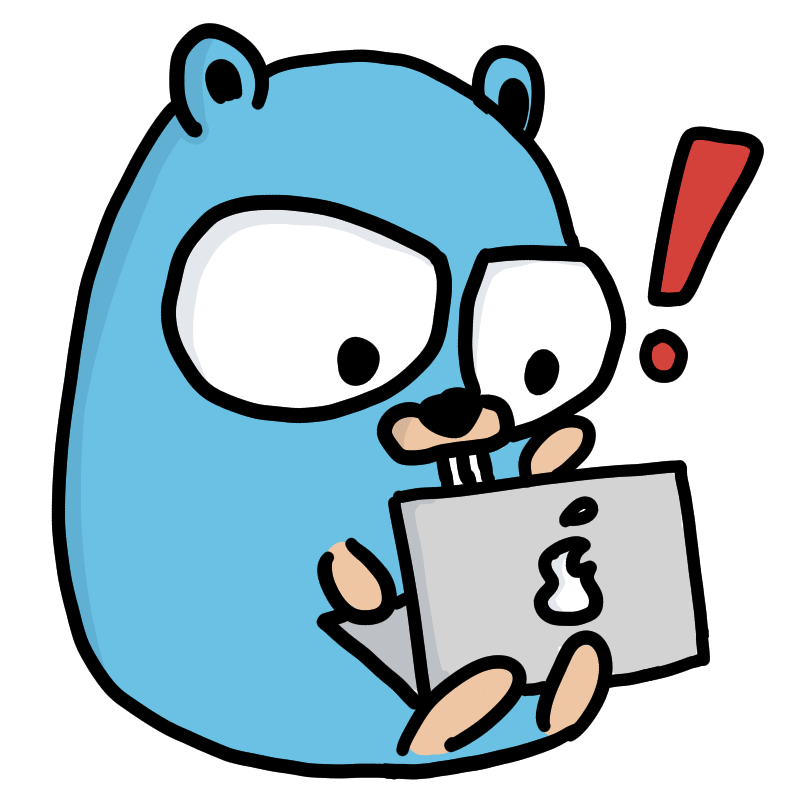

# Finding my Art
I'm mainly a CGI artist. I illustrate with [Krita](https://krita.org) too sometimes. I post my art to my [Instagram](https://instagram.com/daringcuteseal) and my [DeviantArt](https://deviantart.com/daringcuteseal).

# Wallpapers
Found out that many people liked my [Gentoo wallpaper](https://www.reddit.com/r/linuxmasterrace/comments/u0cxix/what_do_you_think_about_this_wallpaper/) that I used as [an entry to Gentoo's 2022 art contest](https://bugs.gentoo.org/847928), so I made more!

You can check the catalog at [wallpapers.daringcuteseal.xyz](https://wallpapers.daringcuteseal.xyz). Some wallpapers haven't gotten a place on the catalog yet, so check out [my GitHub repository](https://github.com/DaringCuteSeal/wallpapers) for the entire collection.

# Sticker Designs
I release some of my A3 sticker designs 
Most of them are programming/FOSS-related. [check them out!](https://github.com/DaringCuteSeal/fossstickers")