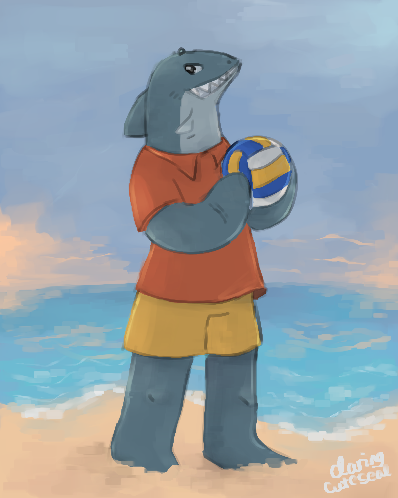
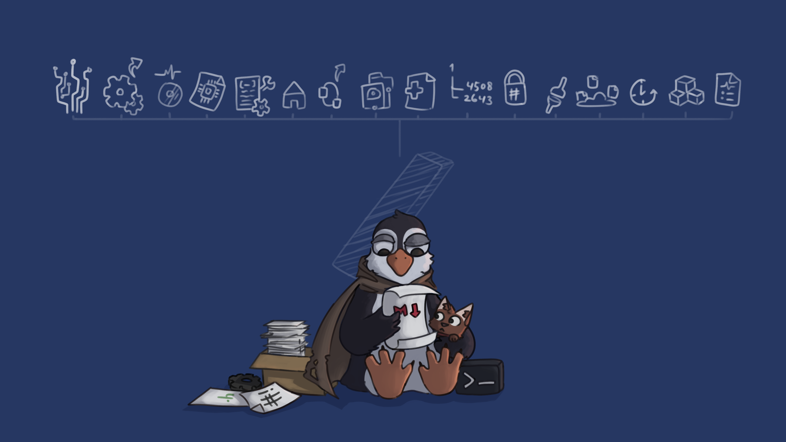

---

 

A 2D illustration containing one or more of your characters. See [#Size](#size) for pricing.

Click the button below for further information if you're interested.

<a href="form"><button class="fancybutton">Place an order now!</button></a>

# Options

## Size

## Style

## Finish

 

<h1>Gallery</h1>

My art range is kinda broad, so I'll just place some examples below (click image to expand). Some characters aren't owned by me, see my [ArtFight page](https://artfight.net/~Daringcuteseal). Visit my [Instagram page](https://instagram.com/daringcuteseal) or my [DeviantArt page](http://deviantart.com/) for even more.

 

    

    

    

    

    

    

    

    

    

    

    

    

    

    

    

    

    

    

    

Portrait of Will Wood

    

