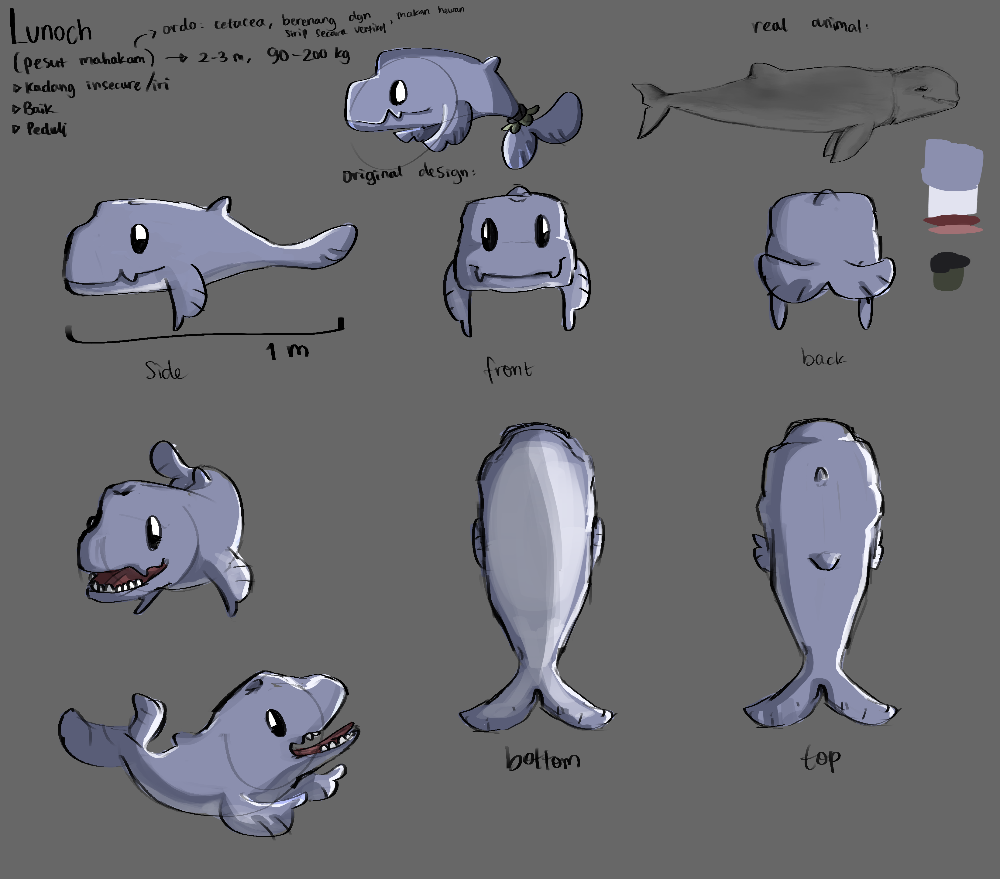
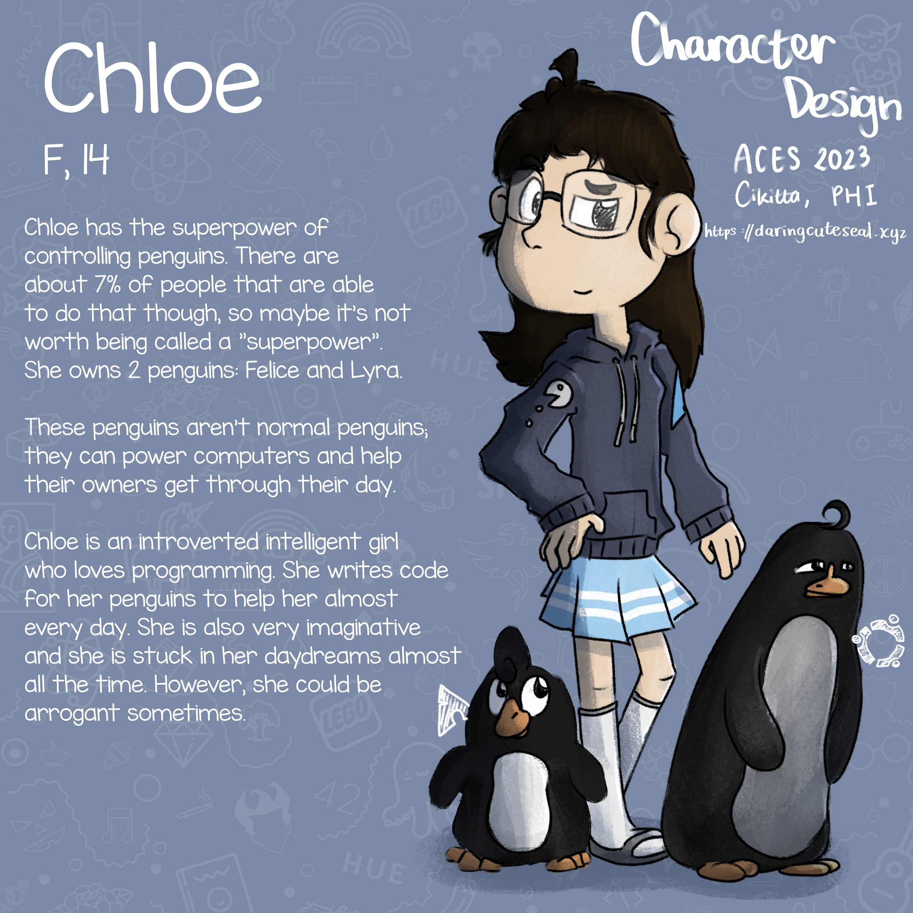
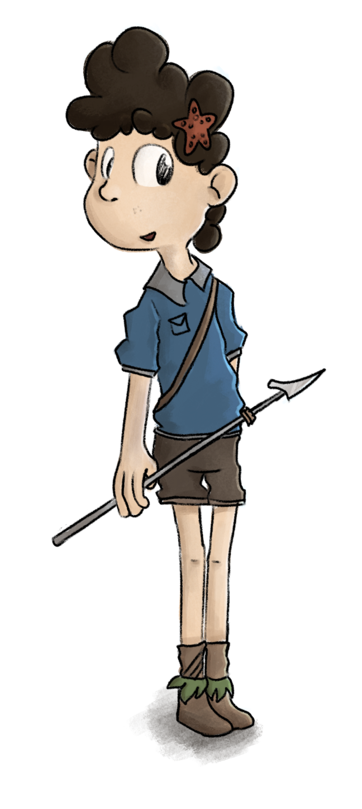
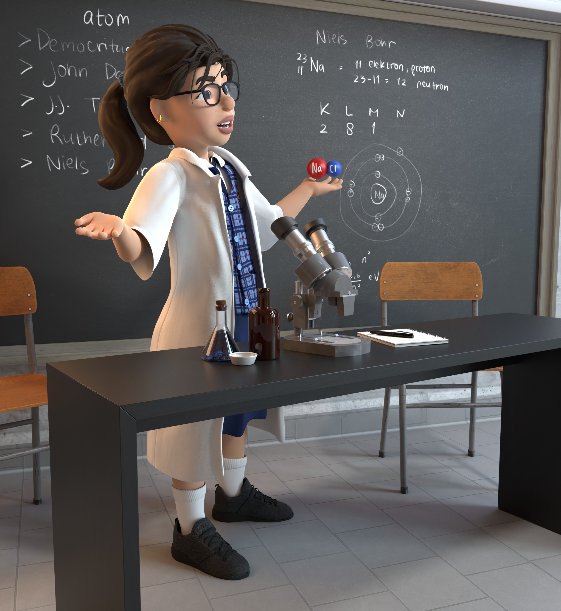
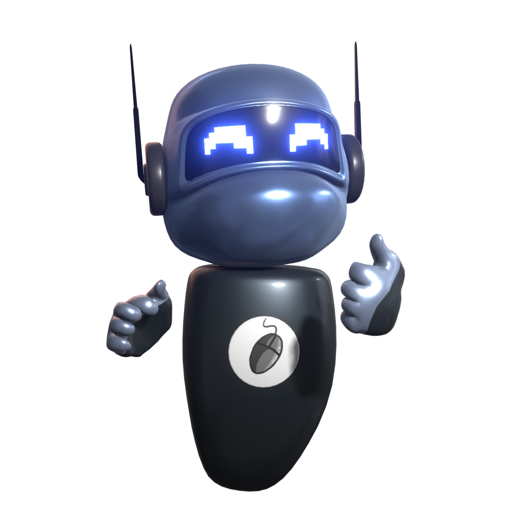
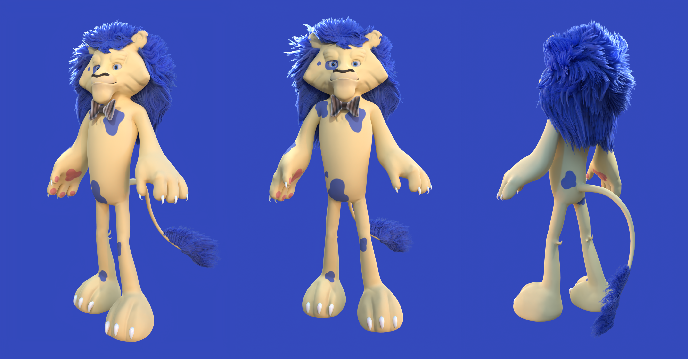
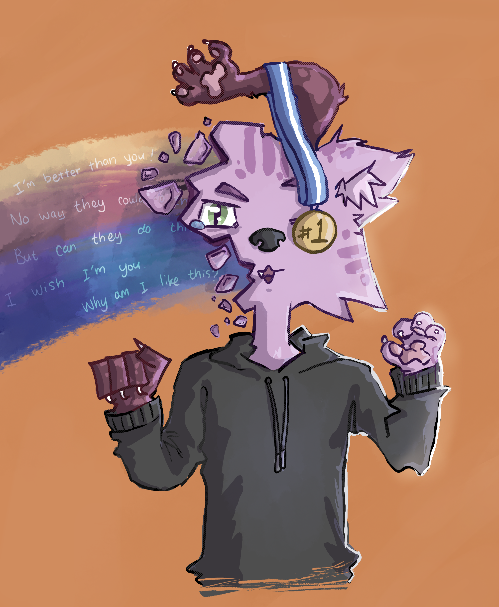
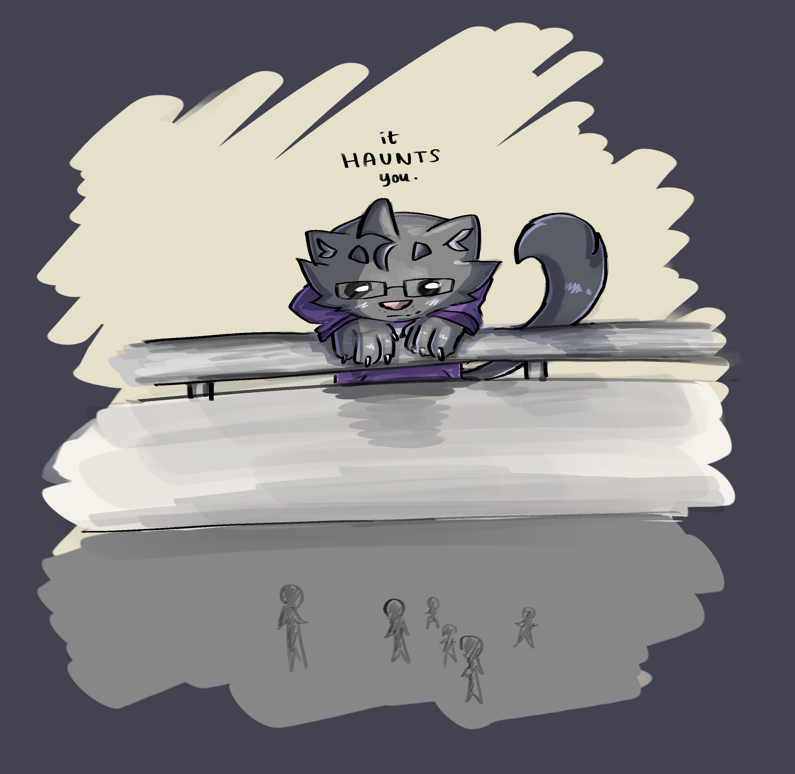
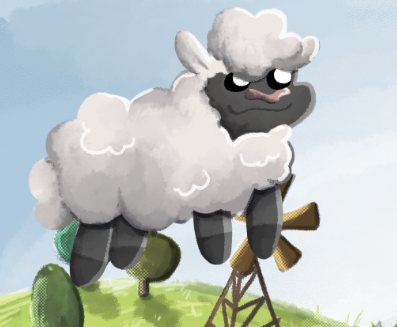
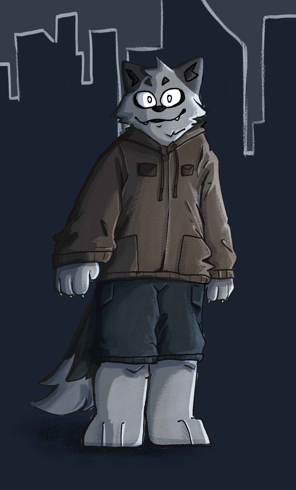

Info
====

*   To ask for a commission, please [mail me](mailto:daringcuteseal@gmail.com).
*   I'm not very picky for the pricing. Perhaps any amount over than $2 for 2D illustration and over $5 for 3D stuff. Pay what you think my art is worth.
*   Check out my [DeviantArt](https://www.deviantart.com/daringcuteseal), [Instagram](https://instagram.com/daringcuteseal), and [Sketchfab](https://sketchfab.com/Mysticreator) for other examples of my work.
*   Due to busy times with my school, your requests might take longer to finish than expected.

Categories
==========

Character Design
----------------

**You will get:**

*   A character reference sheet with simple sketch, color, and shading.
*   (Optional) a biography about the character.

I accept any kind of creature. Humans, animals, mystical creatures, whatever you want. Describe shortly and I'll be creative, or describe in full detail and I'll blow it to reality. Takes from a couple days to months, depending on your approval.

3D Scene Render
---------------

**You will get:**

*   A render of a scene.

I can make many stuff. Not very good at humans though (I'm able to make simple ultra-stylized humans):

 More examples can be seen in my [wallpapers page](https://wallpapers.daringcuteseal.xyz).

Character 3D Model
------------------

**You will get:**

*   A plain render of a your character.
*   A `.blend` model.

Send me a reference sheet and I'll make a 3D model for you. No humans. You might want to specify how it's made, like if you need it to be in high-poly or in low-poly, etc. I can optionally rig it (only basic rig).

2D Illustration
---------------

### Semi-Realistic Animal Portraits

Headshot only for complex animals; I might be able to do fullbody for simpler animals.

### Ink-Styled (Solid Lines) Illustration

### Organic-Looking Illustration

Posters/Flyers
--------------

**You will get:**
* Well, a poster/flyer.

Animation (3D/2D)
-----------------

**You will get:**
* An animation (any format you prefer).

(Note: please don't email me and ask for $1 animation 💀)

<iframe width="560" height="315" src="https://www.youtube.com/embed/VDJWoM5AC4o?si=t_CpyGzz8wo32VAf" title="YouTube video player" frameborder="0" allow="accelerometer; autoplay; clipboard-write; encrypted-media; gyroscope; picture-in-picture; web-share" allowfullscreen></iframe>

<iframe width="560" height="315" src="https://www.youtube.com/embed/kYDscsf-vE0?si=3LhwvPgDG5j0Q7Iy" title="YouTube video player" frameborder="0" allow="accelerometer; autoplay; clipboard-write; encrypted-media; gyroscope; picture-in-picture; web-share" allowfullscreen></iframe>
