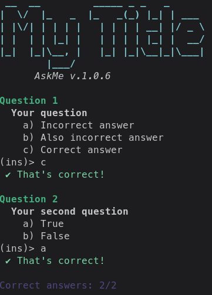
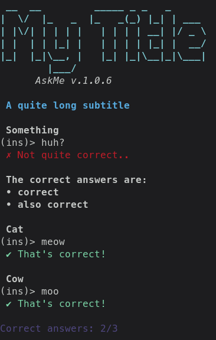
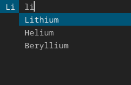
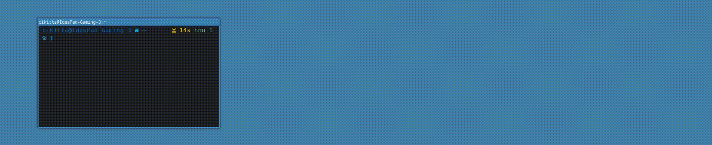
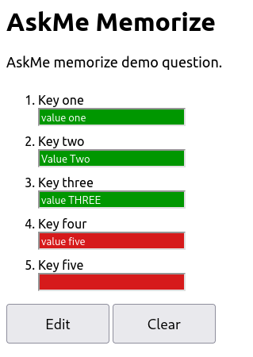
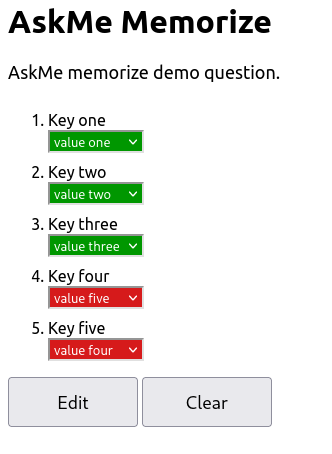

AskMe is a collection of simple shell scripts to help you study, at the comfort of your terminal. I don't know how other people study but I totally have to answer some questions. Its files are still very shell-y but it should be fine for those using the terminal all the time.

As of now, it includes:
- AskMe Multiple Choices
- AskMe Memorize
- AskMe-dmenu
- AskMe Web (memorize)

## Multiple Choices


AskMe Multiple Choices supports multiple choices, from a to z. The questions are made by declaring functions called `q_1`, `q_2`, `q_3`, and so on. You can set some properties and a title
 with the `props` function.

Here's an example:

```bash
#!askme-multchoices

props()
{
	title="My Title"
	shuffle_questions=yes
	shuffle=yes
	wait_duration=1
}

q_1()
{
	shuffle=no
	question="Your question"
	show_correct=yes
	choices=("Incorrect answer" "Also incorrect answer" "Correct answer")
	answer=3
}

q_2()
{
	question="Your second question"
	show_correct=no
	choices=("True" "False")
	answer=1
}
```

And how it looks like with AskMe:



## Memorize

AskMe Memorize is used for memorizing stuff like translations, meanings, etc. It supports multiple answers too, but you have to type in the full associated answer instead of only a letter.

Here's an example:

```bash
#!askme-memorize

title="My Title"
subtitle="A quite long subtitle"

show_correct=yes
shuffle=yes
loop=no
wait_duration=".7"

declare -A questions=(
["Cow"]="Moo"
['Cat']='Meow'
['Something']='("correct" "also correct")'
)
```

And how it looks like:



## dmenu

AskMe-dmenu is just AskMe Memorize with [dmenu](https://tools.suckless.org/dmenu/).

Sometimes you don't need to memorize the entire word precisely.. so I wrote AskMe-dmenu which uses dmenu that shows you all the possible choices.

Here's how it looks like:



And a GIF showing me using it:



## Web (Memorize)

AskMe Web (memorize) is a port of AskMe Memorize but for browsers. I wrote this so I could embed AskMe to my [Notion](https://notion.so) pages. It has two modes: input mode and dropdown mode. Input mode lets the user to input answers manually, while dropdown mode lets the user to choose answers with dropdown menus.

You can host it yourself by [getting the source code](https://github.com/DaringCuteSeal/AskMe/tree/main/web/memorize), or use my instance at [daringcuteseal.xyz/software/askme/web/memorize](https://daringcuteseal.xyz/software/askme/web/memorize).

Here's how it looks like with input mode:



And dropdown mode:




## Web (List Memorize)
Embeddable list memorizer.
From a studying survey™ at my class, a lot of my friends apparently "asked themselves" when studying, which is a bad way to memorize something.

Also, check out [list-memorize](https://raw.githubusercontent.com/DaringCuteSeal/shell-scripts/main/list-memorize) for a based studying experience from the CLI.

Here's an example:
```json
{
    "title": "An Example Title",
    "description": "An example description",
    "list":
    [
        "List one",
        "List two",
        "List three",
        "List four"
    ]
}
```

How it looks like:


- Use the most left input box to type a string value.
- Use the `Add` button to add the string from the input box to the list.
- Use the `Check` button to match your answers with the correct answers.
- Use the `Clear` button to start over.

### Demo
[CIVZ with a sample list](/software/civz?file=demo/try.json).

Answers are:
1. List one
2. List two
3. List three


# History

The first concept of AskMe came from a little handcrafted shell script I wrote back when I tried to memorize some Sundanese words with its "sounding". Actually I don't even understand what that is, but I just have to memorize that 💀 Anyways, it was a simple 64-lined script that asks you a word and expects you to answer the correct associated answer, kinda like a flash card or some sort of that. It was actually even more simple back then, but became too simple for me soon.

A couple days before my mid-term test, I decided to write what now known as "AskMe Multiple Choices", which is a nicer more sophisticated shell script that supports multiple choices answers. After my mid-term test was done, I really liked my "AskMe Multiple Choices" and decided to write what now known as "AskMe Memorize", which was a better version of that first 64-lined script. Then, when I had to memorize some Latin/Greek words and its meanings, I found it too hard and unnecessary to memorize the entire thing, so I wrote Askme-dmenu that shows all the available choices.

---

More info is available at [AskMe's GitHub page](https://github.com/DaringCuteSeal/askme).
