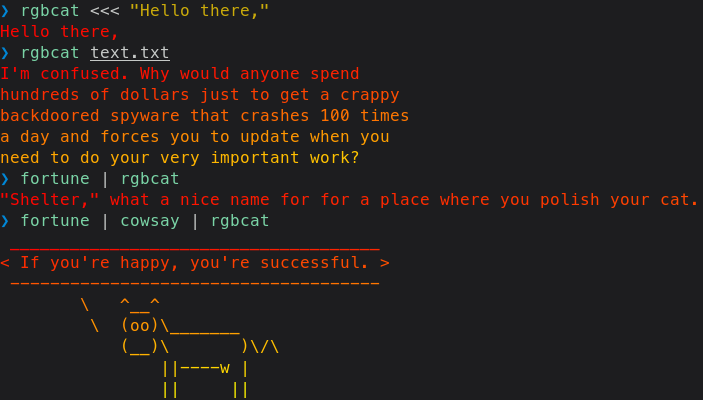

RGBcat is a little software that prints a text file with rainbow color. It's similar to [lolcat](https://github.com/busyloop/lolcat/) but less sophisticated and faster™.

[Grab the source code here](rgbcat.c). Or get a [pre-compiled x86\_64 glibc Linux binary](rgbcat) (md5: `a1ffe12f4dffa538bccc91de519a02ac`).

Also yeah I can't do math and stuff so the source code is stupid—but hey it works I guess.
