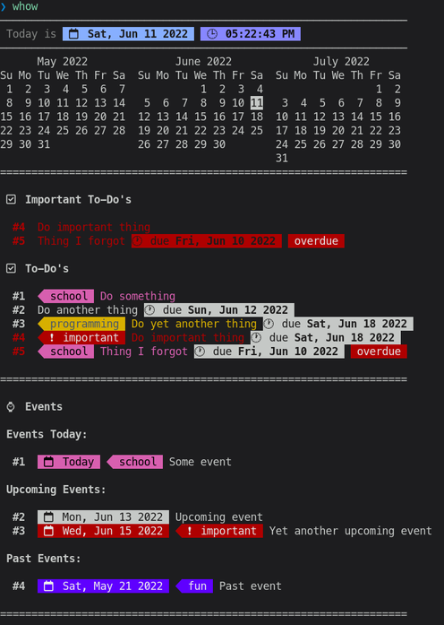
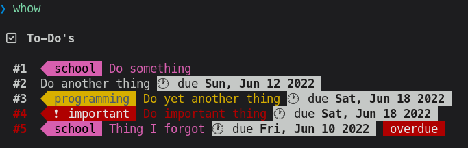
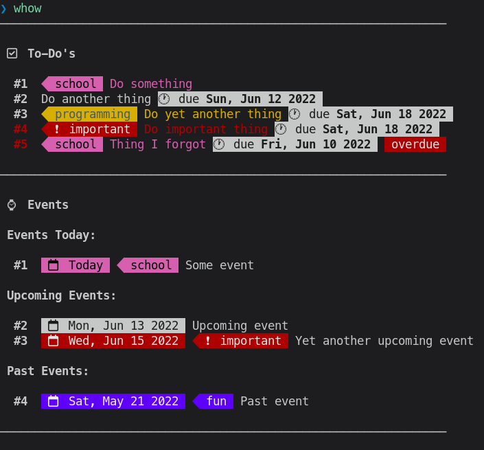
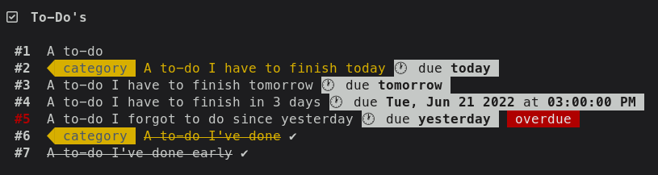
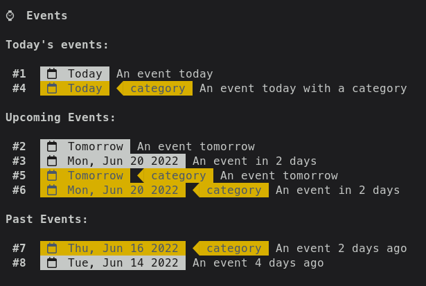

Whow - when, how?

Whow is a simple and fancy CLI task manager, written in BASH. It basically takes your text files and render a human-readable view based on those files. It also provides a way to manipulate those files, although it's still not fully completed yet.

Here are some screenshots:







# Files

## Configuration

Whow is very customizable and extensible. You can change basic stuff like date and time formatting, categories with its colors, to more advanced stuff like rearranging sections and even adding your own custom sections.

## To-Do's

I tried my best to hide the shell-y syntax, but for now, you have to call the `todo` command to add one. They reside on your `todos` file inside a cache directory. Here's an example (the date as of me writing this page is June 18 2022):

```
todo "A to-do"
todo "A to-do I have to finish today" 06/18/2022 @category
todo "A to-do I have to finish tomorrow" 06/19/2022
todo "A to-do I have to finish in 3 days" "06/21/2022^3 PM"
todo "A to-do I forgot to do since yesterday" 06/17/2022
todo "A to-do I've done" @category v
todo "A to-do I've done early" "06/21/2022" v
```

And the rendered view, with the command `whow show todos`:



## Events

Although not sophisticated enough, managing events with Whow is still possible. Same as to-do's, you still have to call the `event` command to add an event, and they reside on your `events` file inside a cache directory. Here's an example:

```
event "06/18/2022" "An event today"
event "06/19/2022" "An event tomorrow"
event "06/20/2022" "An event in 2 days"

event "06/18/2022" "An event today with a category" @category
event "06/19/2022" "An event tomorrow" @category
event "06/20/2022" "An event in 2 days" @category

event "06/16/2022" "An event 2 days ago" @category
event "06/14/2022" "An event 4 days ago"
```

And the rendered view (`whow show events`):




# Inspiration and History

On my computer extracurricular, I had to use [Trello](https://trello.com/)—which kinda inspired me to write Whow. I began writing Whow since March 18, but abandoned it for a while, before continuing its development back somewhere around May. This is basically just me meming "reject bloated web apps, return to DIY shell scripts" though. But yeah, I actually use it (almost) every day.

----

More info is available at [Whow's GitHub page](https://github.com/DaringCuteSeal/whow/).

